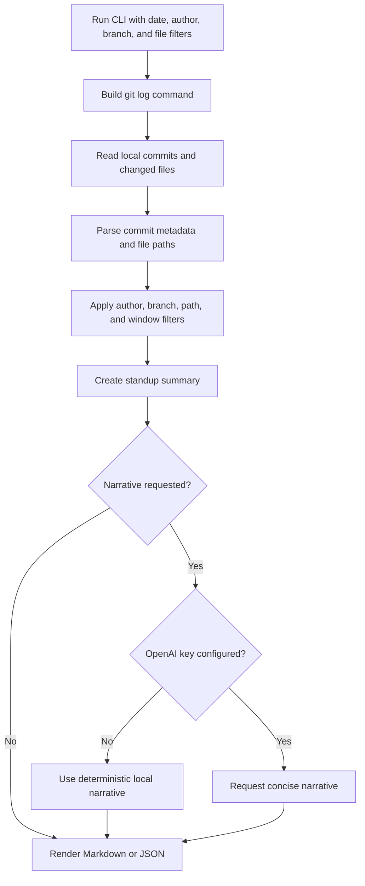

# git-standup-bot

`git-standup-bot` is a TypeScript CLI that turns local git history into standup-ready Markdown or JSON. It helps engineers, team leads, delivery managers, and maintainers summarize real work from commits without giving a third-party service access to the repository.

The bot is useful when a team needs a quick daily update, a weekly engineering digest, a handoff note, release-prep context, or a lightweight audit trail of what changed in a branch or path. It works from git data first, so it fits teams that already write meaningful commits and want repeatable summaries instead of manual status archaeology.

## How It Works



The CLI runs `git log` in the selected repository, using date windows, branch or revision names, and pathspecs supplied through flags. It parses commit hash, author, author email, ISO date, refs, subject, body, and changed file paths.

The summary step counts commits, authors, changed files, inferred blockers, branches, highlights, and commit details. Blockers are inferred from words such as `blocked`, `stuck`, `waiting`, `failed`, `wip`, `todo`, and `fixme` in commit subjects or bodies.

Output is deterministic by default. Markdown is intended for standups, Slack, pull request context, or handoff notes. JSON is intended for automation, dashboards, and downstream reporting. Optional narrative mode can call the OpenAI Responses API when `OPENAI_API_KEY` is configured; otherwise it falls back to a local deterministic narrative.

## Setup

Requirements:

- Node.js 20.19 or newer
- npm bundled with a supported Node.js release
- Git available on `PATH`
- A local git repository to summarize

Install and build:

```bash
npm install
npm run build
```

Run from this repository:

```bash
npm start -- --days 1 --format markdown
```

After publishing or linking the package, run the binary directly:

```bash
git-standup-bot --days 1 --author "Ada Lovelace" --branch main
```

## Commands

```bash
npm test
npm run lint
npm run typecheck
npm run build
npm run audit
npm run outdated
```

`npm run audit` fails on moderate or higher npm advisories. `npm run outdated` checks the npm registry for direct dependencies that no longer match the current installed, wanted, and latest versions.

## CLI Usage

```bash
git-standup-bot [options]
```

| Option | Description |
| --- | --- |
| `--since <date>` | Include commits on or after a git-compatible date. |
| `--until <date>` | Include commits on or before a git-compatible date. |
| `--days <number>` | Use a rolling window ending now. Ignored when `--since` is provided. |
| `--author <value>` | Filter by author name or email. Repeat or pass comma-separated values. |
| `--branch <name>` | Read activity from a branch or revision. Repeat for multiple branches. |
| `--file <path>` | Limit activity to changed files under a pathspec. Repeat for multiple pathspecs. |
| `--format <json\|markdown>` | Choose output format. Defaults to `markdown`. |
| `--json` | Shortcut for `--format json`. |
| `--markdown` | Shortcut for `--format markdown`. |
| `--narrative` | Add a narrative summary. Uses OpenAI only when configured. |
| `--no-openai` | Force deterministic fallback narrative even when an API key exists. |
| `--cwd <path>` | Run git commands from a specific repository directory. |
| `--help` | Show help. |
| `--version` | Show package version. |

Examples:

```bash
git-standup-bot --days 1 --format markdown
git-standup-bot --since 2026-05-01 --until 2026-05-24 --branch main --json
git-standup-bot --since yesterday --file src --file test --narrative --no-openai
git-standup-bot --days 7 --author "ada@example.com" --cwd ../another-repo
```

## Configuration

The tool does not require environment variables for normal summaries. Optional narrative generation can use these values from your shell or an ignored local `.env` file:

```bash
OPENAI_API_KEY=
OPENAI_MODEL=gpt-4.1-mini
OPENAI_BASE_URL=https://api.openai.com/v1
```

Use `.env.example` as the safe tracked template. Keep real keys in `.env`, `.env.local`, your shell, or your secret manager. The repo ignores `.env` and `.env.*` while explicitly keeping `.env.example` tracked.

## Codebase Structure

| Path | Purpose |
| --- | --- |
| `src/bin.ts` | Node executable entrypoint. |
| `src/cli.ts` | Argument parsing, command orchestration, help text, and process result shaping. |
| `src/git.ts` | `git log` argument construction, command execution, and commit parsing. |
| `src/summary.ts` | Standup totals, highlights, changed-file counts, branches, and blocker inference. |
| `src/renderers.ts` | Markdown and JSON renderers. |
| `src/narrative.ts` | Optional OpenAI narrative generation and deterministic fallback. |
| `src/types.ts` | Shared TypeScript interfaces. |
| `test/` | Vitest coverage for CLI parsing, git parsing, summaries, renderers, and narrative behavior. |
| `.github/workflows/ci.yml` | CI for install, audit, outdated checks, tests, lint, typecheck, and build. |
| `.github/dependabot.yml` | Weekly npm and GitHub Actions dependency update checks. |

## Privacy And Security

- Git parsing happens locally through the installed `git` CLI.
- Normal Markdown and JSON summaries do not call the network.
- Optional OpenAI narrative mode sends only summary fields, highlights, blockers, authors, branches, and changed-file paths, not repository contents.
- Use `--no-openai` when summaries must stay fully local.
- Do not commit real `.env` files, API keys, private handoff notes, or generated local workflow files.
- Review commit messages before sharing summaries if they may contain customer names, credentials, incident details, or private business context.
