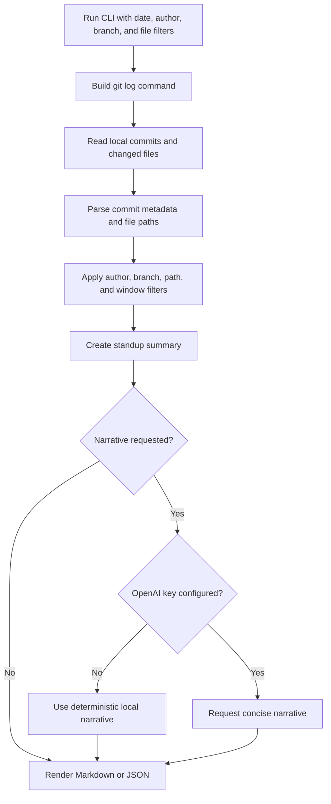

# Architecture

`git-standup-bot` is a TypeScript CLI that turns local git history into Markdown or JSON for standups. It works from git data first, so no outside service needs access to the repository.

## Use cases

The bot helps when a team needs a quick daily update, a weekly engineering digest, a handoff note, release preparation context or a lightweight audit trail of what changed in a branch or path. It fits teams that already write meaningful commits and want repeatable summaries instead of writing status updates by hand.

## Flow

The diagram source is [architecture.mmd](architecture.mmd).

The CLI runs `git log` in the selected repository, using date windows, branch or revision names and pathspecs supplied through flags. It parses commit hash, author, author email, ISO date, refs, subject, body and changed file paths.

The summary step counts commits, authors, changed files, inferred blockers, branches, highlights and commit details. Blockers are inferred from words such as `blocked`, `stuck`, `waiting`, `failed`, `wip`, `todo` and `fixme` in commit subjects or bodies.

Output is deterministic by default. Markdown is intended for standups, Slack, pull request context or handoff notes. JSON is intended for automation, dashboards and downstream reporting. Optional narrative mode can call the OpenAI Responses API when `OPENAI_API_KEY` is configured. Otherwise it falls back to a local deterministic narrative.

## Components

| Path | Role |
| --- | --- |
| `src/bin.ts` | Node executable entrypoint |
| `src/cli.ts` | Argument parsing, command orchestration, help text and process result shaping |
| `src/git.ts` | `git log` argument construction, command execution and commit parsing |
| `src/summary.ts` | Standup totals, highlights, changed file counts, branches and blocker inference |
| `src/renderers.ts` | Markdown and JSON renderers |
| `src/narrative.ts` | Optional OpenAI narrative generation and deterministic fallback |
| `src/types.ts` | Shared TypeScript interfaces |
| `test/` | Vitest coverage for CLI parsing, git parsing, summaries, renderers and narrative behavior |
| `.github/workflows/ci.yml` | CI for install, audit, outdated checks, tests, lint, typecheck and build |
| `.github/dependabot.yml` | Weekly npm and GitHub Actions dependency update checks |
